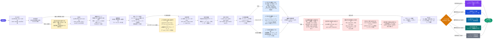

```mermaid
flowchart LR
    START([診断開始]) --> Q1

    %% ── カテゴリ0：プロフィール ──
    Q1["生まれ年\n1990年以前 / 1991〜1995年\n1996〜2000年 / 2001年以降"]
    Q1 --> Q2

    Q2["最終学歴\n高校 / 専門学校 / 短大\n大学 / 大学院"]
    Q2 -->|高校 / 専門学校 / 短大| Q4
    Q2 -->|大学 / 大学院| Q3

    Q3["出身校の水準 ★条件付き\n旧帝大・早慶 / MARCH・関関同立\n日東駒専・産近甲龍 / その他の大学"]
    Q3 --> Q4

    Q4["卒業年\n2024年以降 / 2020〜2023年\n2016〜2019年 / 2011〜2015年 / 2010年以前"]
    Q4 --> Q5

    %% ── カテゴリ1：職場環境 ──
    Q5["勤務先のタイプ\n外資系大手 / 国内大手上場企業\n中堅・ベンチャー上場 / 非上場ベンチャー\n中小企業・その他"]
    Q5 --> Q6

    Q6["雇用形態\n正社員 / 契約社員 / 派遣社員\nフリーランス / その他"]
    Q6 --> Q7

    Q7["関わっている業界\nIT/インターネット/通信 / 金融/保険\nコンサルティング / メーカー/製造業\n商社/卸売 / その他"]
    Q7 -->|IT/インターネット/通信| Q8
    Q7 -->|その他の業界| Q9

    Q8["より具体的な領域 ★条件付き\nSaaS/クラウドサービス / フィンテック/ブロックチェーン\nAI/機械学習 / ECプラットフォーム\nゲーム/エンタメ / その他IT"]
    Q8 --> Q9

    Q9["従業員数\n10人未満 / 10〜49人 / 50〜299人\n300〜999人 / 1000〜2999人 / 3000人以上"]
    Q9 --> Q10

    Q10["現在の役職\n代表/役員 / 部長/マネージャー\n課長/チームリーダー / 主任/リーダー / 役職なし"]
    Q10 --> Q11

    Q11["現在の年収\n〜300万 / 300〜400万 / 400〜500万\n500〜600万 / 600〜800万 / 800万〜"]
    Q11 --> Q12

    %% ── カテゴリ2：職種・経験 ──
    Q12["主な経験職種\n営業 / マーケティング/企画 / ITエンジニア\nコンサルタント / 管理部門 / その他"]
    Q12 -->|営業| Q13a
    Q12 -->|ITエンジニア| Q13b
    Q12 -->|その他の職種| Q13c

    Q13a["より具体的な職種（営業）\n法人営業（大手向け）/ 法人営業（中小向け）\n個人営業 / 代理店営業\nインサイドセールス / その他営業"]
    Q13b["より具体的な職種（エンジニア）\nバックエンドエンジニア / フロントエンドエンジニア\nインフラ/SRE / 機械学習/AI / その他エンジニア"]
    Q13c["より具体的な職種（その他）\n企画/戦略 / マーケティング\n経営管理/財務 / コンサルティング / その他"]

    Q13a --> Q14
    Q13b --> Q14
    Q13c --> Q14

    Q14["職種の経験年数\n1年未満 / 1〜2年 / 2〜4年 / 4年以上"]
    Q14 -->|営業以外| Q20
    Q14 -->|営業| Q15

    %% ── カテゴリ3：実績（営業のみ） ──
    Q15["担当顧客の規模 ★営業のみ\n個人・小規模（〜50名）/ 中小企業（51〜300名）\n中堅企業（301〜1000名）/ 大企業（1001〜5000名）\nエンタープライズ（5000名〜）"]
    Q15 --> Q16

    Q16["営業目標の達成率 ★営業のみ\n60%未満 / 60〜80% / 80〜100%\n100〜120% / 120%以上"]
    Q16 --> Q17

    Q17["組織内の営業成績 ★営業のみ\n下位（60%以下）/ 中位（40〜60%）\n上位（20〜40%）/ 上位（10〜20%）/ トップ（10%以内）"]
    Q17 --> Q18

    Q18["取り扱い商材 ★営業のみ\nクラウド/SaaS / 人材/採用サービス\n広告/マーケティング / 物流/インフラ / その他"]
    Q18 --> Q19

    Q19["取引商材の単価 ★営業のみ\n10万円未満 / 10〜100万\n100万〜1000万 / 1000万〜1億 / 1億以上"]
    Q19 --> Q20

    %% ── カテゴリ4：スキル ──
    Q20["マネジメント経験\nなし / 1年未満 / 1〜2年 / 2年以上"]
    Q20 --> Q21

    Q21["英語力\nなし/初級 / 日常会話レベル\nビジネス会話レベル / ネイティブ/流暢"]
    Q21 --> SCORE

    %% ── 診断結果 ──
    SCORE{スコア計算\n現在年収 × 倍率}

    SCORE -->|潜在年収 800万〜| R1["🚀 ハイポテンシャル層\nランク S｜市場トップクラス型"]
    SCORE -->|潜在年収 650〜800万| R2["💼 即戦力ミドル層\nランク A｜30代ジャンプ型"]
    SCORE -->|潜在年収 500〜650万| R3["📈 標準的キャリア層\nランク B｜着実成長型"]
    SCORE -->|潜在年収 400〜500万| R4["🌱 成長余地あり層\nランク B｜経験積み上げ型"]
    SCORE -->|潜在年収 〜400万| R5["🔄 キャリア再設計層\nランク B｜方向転換型"]

    R1 & R2 & R3 & R4 & R5 --> RESULT([結果画面\n求人CTA表示])

    %% ── スタイル ──
    style START fill:#4f46e5,color:#fff,stroke:none
    style RESULT fill:#059669,color:#fff,stroke:none
    style SCORE fill:#d97706,color:#fff,stroke:none
    style Q3 fill:#fef3c7,stroke:#d97706
    style Q8 fill:#fef3c7,stroke:#d97706
    style Q13a fill:#dbeafe,stroke:#3b82f6
    style Q13b fill:#dbeafe,stroke:#3b82f6
    style Q13c fill:#dbeafe,stroke:#3b82f6
    style Q15 fill:#fee2e2,stroke:#ef4444
    style Q16 fill:#fee2e2,stroke:#ef4444
    style Q17 fill:#fee2e2,stroke:#ef4444
    style Q18 fill:#fee2e2,stroke:#ef4444
    style Q19 fill:#fee2e2,stroke:#ef4444
    style R1 fill:#7c3aed,color:#fff,stroke:none
    style R2 fill:#1d4ed8,color:#fff,stroke:none
    style R3 fill:#0369a1,color:#fff,stroke:none
    style R4 fill:#0f766e,color:#fff,stroke:none
    style R5 fill:#6b7280,color:#fff,stroke:none
```
